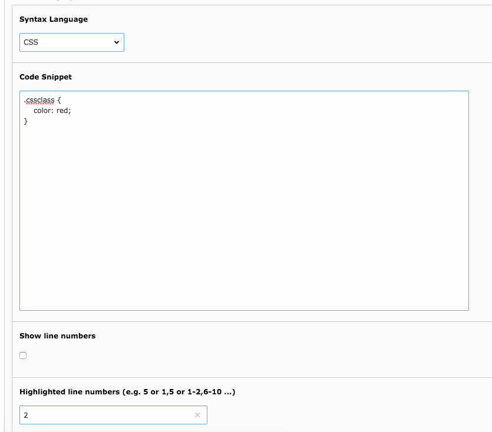
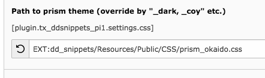
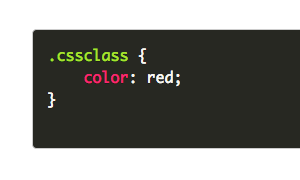

.. ==================================================
.. FOR YOUR INFORMATION
.. --------------------------------------------------
.. -*- coding: utf-8 -*- with BOM.

.. include:: ../Includes.txt

.. _users-manual:

Installation & Usuage
=====================

Installation
------------

Download and install the extension with the extension manager module.

Setup
-----

Include the static TypoScript of the extension. Create a plugin on a page, select the coding language you want to highlight and insert the code snippet.

Configuration
-------------

There's nothing more to say ;)

Prism.js Themes
---------------

You can easily switch the Prism.js theme by changing the extension constants. prism.css is the default stylesheet.
Following stylesheets are available:

* prism_coy.css
* prism_dark.css
* prism_funky.css
* prism_okaido.css
* prism_solarizedlight.css
* prism_twilight.css

	Override CSS file in constants

	Okaido theme in frontend
	
Further information of Prism.js can be found on http://prismjs.com